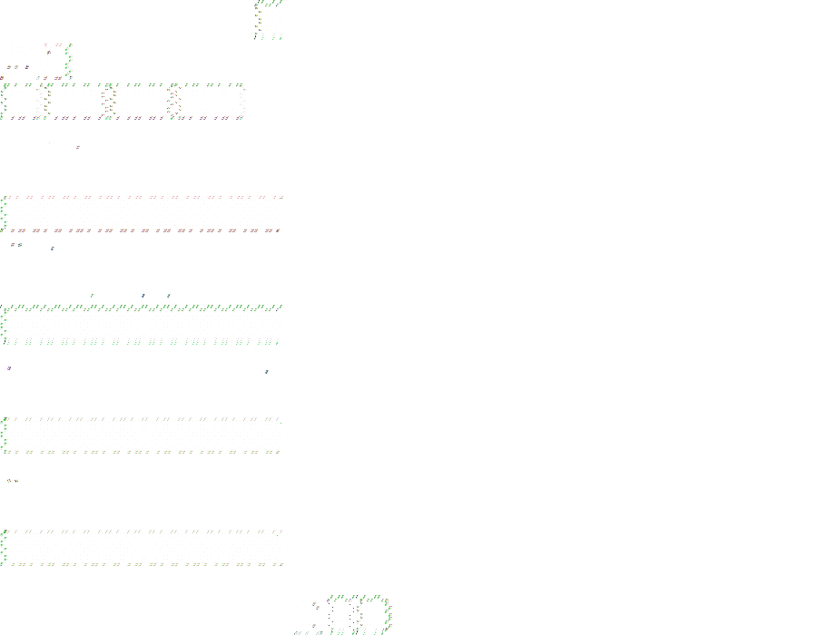

# WhatsApp for Tsyne

A WhatsApp messaging client built with Tsyne's pseudo-declarative UI framework. This app uses WAHA (WhatsApp HTTP API) as its backend to provide real WhatsApp functionality.



## Features

- **QR Code Login**: Scan with your phone to authenticate
- **Chat List**: View all your conversations with filters (All, Unread, Groups, Archived)
- **Search**: Search through your chats by name or message content
- **Conversation View**: Read and send messages
- **Reply to Messages**: Quote messages when replying
- **Reactions**: React to messages with emojis
- **Real-time Updates**: Receive messages and typing indicators via WebSocket
- **Read Receipts**: See message delivery status (sent, delivered, read)

## Architecture

```
┌─────────────────────────────────────────────────────────────────┐
│                  WhatsApp Tsyne App                             │
│                                                                 │
│   ┌─────────────────┐    ┌─────────────────────────────────┐   │
│   │   whatsapp.ts   │───▶│  IWhatsAppService Interface     │   │
│   │   (Tsyne UI)    │    │                                 │   │
│   └─────────────────┘    │  ┌──────────────────────────┐   │   │
│                          │  │  MockWhatsAppService     │   │   │
│                          │  │  (for testing/demo)      │   │   │
│                          │  └──────────────────────────┘   │   │
│                          │                                 │   │
│                          │  ┌──────────────────────────┐   │   │
│                          │  │  RealWhatsAppService     │───┼───┤
│                          │  │  (wraps WAHA client)     │   │   │
│                          │  └──────────────────────────┘   │   │
│                          └─────────────────────────────────┘   │
└────────────────────────────────────────────────────────────────┘
                                      │
                                      ▼
                          ┌───────────────────────┐
                          │   WAHA Server         │
                          │   (HTTP + WebSocket)  │
                          └───────────────────────┘
                                      │
                                      ▼
                          ┌───────────────────────┐
                          │   WhatsApp Backend    │
                          └───────────────────────┘
```

## Prerequisites

### For Mock Mode (Testing/Demo)
No prerequisites needed. The app will use a mock service with sample data.

### For Real WhatsApp Connection
1. A running WAHA (WhatsApp HTTP API) server
   - See: https://waha.devlike.pro/
   - Docker: `docker run -p 3000:3000 devlikeapro/waha`

2. Set environment variables:
   ```bash
   export WAHA_URL="http://localhost:3000"
   export WAHA_API_KEY="your-api-key"  # Optional
   export WAHA_SESSION="default"       # Optional
   ```

## Installation

```bash
cd larger-apps/whats-app
npm install
```

## Usage

### Run in Mock Mode (Demo)
```bash
npx tsx whatsapp.ts
```

### Run with Real WAHA Backend
```bash
WAHA_URL="http://localhost:3000" npx tsx whatsapp.ts
```

## UI Layout

```
┌─────────────────────────────────────────────────────────────────┐
│ WhatsApp                                              [🚪]      │
├─────────────────────┬───────────────────────────────────────────┤
│ [🔍 Search...]      │ Alice Smith                              │
│ [All][Unread][Groups]│ typing...                               │
│──────────────────────├──────────────────────────────────────────│
│ ● Alice Smith    5m │                                          │
│   See you tomorrow! │ Hi! How are you?              [Alice 2m] │
│──────────────────────│                                          │
│   Bob Johnson   15m │                  Good! How about you?    │
│   Thanks for info!  │                              [You 1m] ✓✓ │
│──────────────────────│                                          │
│ ● Team Chat      2m │ See you tomorrow! 👋         [Alice now] │
│   Meeting at 2pm    │ 👍                                       │
│                     │                        [↩️ Reply] [👍]   │
│                     │────────────────────────────────────────── │
│                     │ [Type a message...]       [📎] [↩️ Send] │
└─────────────────────┴───────────────────────────────────────────┘
```

## Files

- `whatsapp.ts` - Main Tsyne application
- `whatsapp-service.ts` - Service interface + MockWhatsAppService
- `real-whatsapp-service.ts` - Real WAHA client wrapper
- `whatsapp.test.ts` - Jest + TsyneTest tests (47 tests)
- `package.json` - Dependencies and scripts

## Testing

Run all tests:
```bash
npm test
```

Run with headed mode (visible window):
```bash
TSYNE_HEADED=1 npm test
```

Take screenshots:
```bash
TSYNE_HEADED=1 TAKE_SCREENSHOTS=1 npm test
```

### Test Coverage

**TsyneTest UI Tests (11 tests):**
- Display elements (title, search, filters, chat list, avatars)
- Button functionality (send, logout, open chat)
- Input fields (message, search)

**MockWhatsAppService Unit Tests (36 tests):**
- Initialization and state
- Chat CRUD operations
- Message sending with replies
- Filtering and search
- Archive/unarchive operations
- Reactions and message actions
- Event subscriptions
- Login/logout flow

## Pseudo-Declarative Scorecard

How well does this implementation follow [pseudo-declarative-ui-composition.md](../../docs/pseudo-declarative-ui-composition.md) patterns?

| Category | Pattern | Score | Notes |
|----------|---------|-------|-------|
| **Core declarative** | Nested builder layout | 8/10 | `hsplit > border(sidebar: search + chatList) + vbox(header + messages + input)` nesting. Rich messaging layout |
| **Core declarative** | Fluent method chaining | 8/10 | `.withId()` on 43 elements — excellent coverage. `.when()` for conditional rendering. `.bindTo()` for dynamic lists |
| **Core declarative** | Programmatic generation | 7/10 | Loop-based filter button generation. Message list and contact list built dynamically |
| **State architecture** | Observable store | 4/10 | No formal Observable store. State managed via class properties with `rebuildUI()` |
| **Declarative updates** | `.when()` + `.bindTo()` | 5/10 | 1 `.when()` for conditional rendering. 2 `.bindTo()` for dynamic list rendering with `items`/`render`/`trackBy`. No `.bindText()` |
| **Anti-declarative** | No `removeAll()`/`setContent()` | -2 | 2 `setContent()`/`rebuildUI()` calls for full UI rebuilds |
| **Testing** | `.withId()` coverage | 8/10 | 43 IDs — excellent coverage across sidebar, chat area, message input, filter buttons |
| **Design** | Separation of concerns | 6/10 | UI builder methods well-organized. API client separated. But state and UI in same class |
| | **Overall** | **6/10** | Strong `.withId()` coverage (43) and uses `.bindTo()` for list rendering and `.when()` for conditional views. The `rebuildUI()` pattern prevents higher score — moving to Observable store with granular bindings would push this to 8/10 |

## Credits

This is a port of [waha-tui](https://github.com/muhammedaksam/waha-tui) from terminal UI to Tsyne's native desktop GUI framework.

## License

GNU General Public License v3.0
