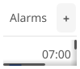

# Alarms

Alarm manager app for setting, toggling, and deleting alarms.

## Features

- Create new alarms with time picker
- Toggle alarms on/off
- Delete individual alarms
- List view of all alarms
- Notification when alarm fires

## Controls

| Action | Description |
|--------|-------------|
| Add Alarm | Create a new alarm at specified time |
| Toggle | Enable/disable an alarm without deleting |
| Delete | Remove an alarm permanently |

## Alarm Properties

Each alarm has:
- **Time**: Hour and minute
- **Enabled**: Whether the alarm is active
- **Label**: Optional description

## Services

The alarms app uses dependency injection for testability:

- `IClockService` - Provides current time for alarm checking
- `INotificationService` - Sends notification when alarm fires
- `IAppLifecycle` - Manages app close behavior

## Pseudo-Declarative Scorecard

How well does this implementation follow [pseudo-declarative-ui-composition.md](../../docs/pseudo-declarative-ui-composition.md) patterns?

| Category | Pattern | Score | Notes |
|----------|---------|-------|-------|
| **Core declarative** | Nested builder layout | 6/10 | `vbox > hbox(header) + scroll(alarm list) + border(add button)` nesting |
| **Core declarative** | Fluent method chaining | 5/10 | `.withId()` on 7 elements. No `.when()` or `.bindTo()` |
| **Core declarative** | Programmatic generation | 6/10 | Loop-based alarm list rendering via `forEach` |
| **State architecture** | Observable store | 3/10 | No Observable store. Alarm data managed directly |
| **Declarative updates** | `.when()` + `.bindTo()` | 1/10 | No reactive bindings. `showForm()` for alarm creation |
| **Anti-declarative** | No `removeAll()`/`setContent()` | 0 | No penalty |
| **Testing** | `.withId()` coverage | 5/10 | IDs on add button, alarm items |
| **Design** | Separation of concerns | 6/10 | Service injection (IClockService, INotificationService) provides testability |
| | **Overall** | **4/10** | Clean alarm list with `showForm()` for CRUD and service injection. No reactive bindings |
