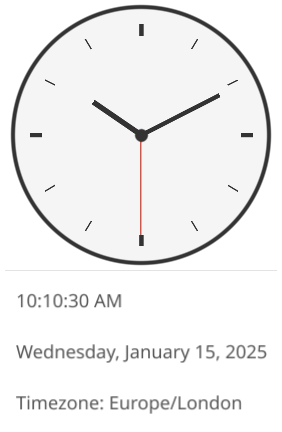

# Clock

Analog and digital clock app displaying current time and date.



## Features

- Analog clock face with hour, minute, and second hands
- Digital time display
- Date display with day of week
- Timezone indicator
- Real-time updates every second

## Controls

The clock runs automatically with no user interaction required.

## Architecture

237 lines. IoC/DI with service interfaces, custom declarative hand bindings.

- **Services**: `IClockService`, `INotificationService`, `IAppLifecycle` — injected for testability
- **Hand binding**: `bindLine()` creates a canvas line and declares a rotation function. The update loop evaluates all bindings each tick — you describe _what_ the hand tracks, not _how_ to move it
- **Programmatic generation**: 12 hour markers generated in a `for` loop with conditional bold at 12/3/6/9

## Pseudo-Declarative Scorecard

How well does this app follow [pseudo-declarative-ui-composition.md](../../docs/pseudo-declarative-ui-composition.md) patterns?

| Pattern | Score | Notes |
|---------|-------|-------|
| **Nested builder layout** | 9/10 | `vbox > center > canvasStack` reads as a visual spec. Clean and minimal |
| **Fluent method chaining** | 7/10 | `.withId()` on two labels, canvas primitives configured via options objects. No `.onClick()` chains (no interaction needed) |
| **Programmatic UI generation** | 9/10 | `for` loop generates 12 hour markers with conditional bold — exactly the pattern the doc recommends over static repetition |
| **Custom declarative binding** | 9/10 | `bindLine()` is called out in the pseudo-declarative doc itself (line 566) as a noteworthy pattern. Declares a rotation function at build time; the loop evaluates it. This is genuinely declarative — you say "this hand tracks hours+minutes/60" not "move to x,y" |
| **IoC / Dependency Injection** | 10/10 | Service interfaces (`IClockService`, `INotificationService`, `IAppLifecycle`) injected into constructor. Mock implementations for testing. Best DI in the repo |
| **`.withId()` for testing** | 7/10 | `time-display` and `date-display` IDs enable 4 TsyneTest tests. Only 2 IDs, but only 2 testable widgets |
| **Reactive bindings** | 2/10 | 2x `setText()` for time/date labels, 0x `.bindText()`. The hand bindings are custom, not framework-level reactive |
| **Lifecycle management** | 9/10 | `registerCleanup()` clears interval, `setCloseIntercept()` stops clock on window close. Proper resource cleanup |
| **Observable store** | N/A | Single data source (system clock) — a store would be over-engineering |
| **Defensive copying** | N/A | No mutable shared state to copy |
| **Declarative visibility** | N/A | Single-view app, nothing to show/hide |
| **Overall** | **6.5/10** | Excels at builder nesting, programmatic generation, custom bindings, and DI — the doc cites this app as exemplary. Falls short on reactive framework bindings (`setText()` instead of `.bindText()`). Several categories don't apply due to the app's simplicity |

### What it does well

- **`bindLine()` is the closest thing to a custom declarative binding in the repo** — rotation functions declared at build time, evaluated reactively by the update loop. The pseudo-declarative doc calls this out as a pattern to learn from
- **Best DI/IoC in the repo** — service interfaces with mock implementations, constructor injection, `registerCleanup()`
- **Programmatic generation** avoids static repetition for the 12 hour markers
- **Zero `removeAll()`** — nothing is torn down and rebuilt

### What it could improve

- Replace `setText()` with `.bindText(() => clock.getCurrentTime().toLocaleTimeString())` — the clock is a textbook case for reactive text binding
- If `.bindText()` were used, the `setInterval` + manual `updateTimeDisplay()` could be replaced by a framework-level animation tick

## Testing

4 TsyneTest integration tests:

```bash
cd phone-apps/clock
npx jest
```

- Time display renders
- Date display renders
- Mocked time shows correctly (3:00 PM)
- Screenshot capture at 10:10:30

Tests use `MockClockService` with `setTime()` for deterministic time — no flaky real-clock assertions.

## Services

- `IClockService` — Provides current time (can be mocked for testing)
- `INotificationService` — For future alarm/notification features
- `IAppLifecycle` — Manages app close behavior

## Files

- `clock.ts` — Main implementation (237 lines)
- `clock.test.ts` — TsyneTest integration tests (94 lines, 4 tests)
- `clock-cosyne.ts` — Alternative Cosyne-based rendering
