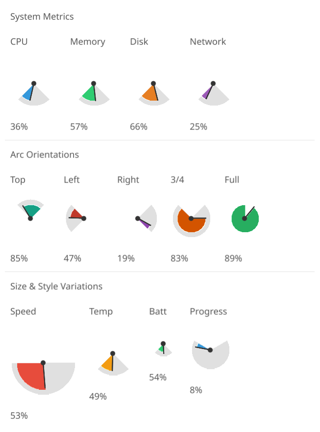

# Gauge Dashboard

Cosyne declarative canvas demo showcasing the gauge primitive with various configurations.



## Features

- **System Metrics**: CPU, Memory, Disk, Network gauges with standard bottom-facing arcs
- **Arc Orientations**: Top, Left, Right, 3/4 Circle, and Full Circle configurations
- **Size & Style Variations**: Different radii (20-50px) and arc sweeps (90-240°)

## Run

```bash
./scripts/tsyne phone-apps/gauge-dashboard/gauge-cosyne.ts
```

## Pseudo-Declarative Scorecard

How well does this implementation follow [pseudo-declarative-ui-composition.md](../../docs/pseudo-declarative-ui-composition.md) patterns?

| Category | Pattern | Score | Notes |
|----------|---------|-------|-------|
| **Core declarative** | Nested builder layout | 7/10 | `vbox > hbox(controls) + padded(gauge grid)` nesting. Multiple gauge configurations |
| **Core declarative** | Fluent method chaining | 6/10 | `.withId()` on 10 elements. 1 `.bindTo()`. 1 `.bindText()` |
| **Core declarative** | Programmatic generation | 6/10 | Loop-based gauge tick mark generation |
| **State architecture** | Observable store | 4/10 | No formal Observable store. Gauge values drive rendering |
| **Declarative updates** | `.when()` + `.bindTo()` | 5/10 | 1 `.bindTo()`, 1 `.bindText()`, `bindValue()` for reactive gauge updates. `refreshAllCosyneContexts()` triggers updates |
| **Anti-declarative** | No `removeAll()`/`setContent()` | 0 | No penalty |
| **Testing** | `.withId()` coverage | 6/10 | IDs on controls and gauges |
| **Design** | Separation of concerns | 6/10 | Gauge rendering via Cosyne primitives |
| | **Overall** | **5/10** | Uses `bindValue()`, `.bindTo()`, and `.bindText()` — reactive Cosyne bindings. Good gauge component showcase |
