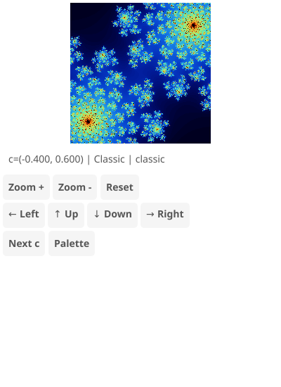

# Julia Set Explorer

Interactive Julia fractal viewer with adjustable c parameter and multiple presets.

## Features

- 6 famous Julia set presets (Classic, Dendrite, Spiral, Rabbit, Dragon, Siegel)
- Multiple color palettes (classic, fire, ice, rainbow, ocean, psychedelic, grayscale, copper)
- Click/tap to zoom and recenter
- Scroll wheel zoom centered on cursor
- Keyboard controls for navigation

## Controls

- **Click/Tap**: Zoom in at clicked point
- **Scroll**: Zoom in/out centered on cursor
- **+/-**: Zoom in/out
- **Arrow keys**: Pan
- **P/Space**: Cycle palette
- **N**: Next preset
- **R**: Reset view

## Algorithm

The Julia set uses the iteration `z = z² + c` where c is a fixed complex constant. Points that remain bounded after many iterations are in the set.

## Pseudo-Declarative Scorecard

How well does this implementation follow [pseudo-declarative-ui-composition.md](../../docs/pseudo-declarative-ui-composition.md) patterns?

| Category | Pattern | Score | Notes |
|----------|---------|-------|-------|
| **Core declarative** | Nested builder layout | 6/10 | `vbox > hbox(controls) + center(canvasRaster)` nesting |
| **Core declarative** | Fluent method chaining | 6/10 | `.withId()` on 11 elements. No `.when()` or `.bindTo()` |
| **Core declarative** | Programmatic generation | 2/10 | No loop-based widget generation. Fractal rendered via GPU shader |
| **State architecture** | Observable store | 3/10 | No Observable store. Fractal parameters managed directly |
| **Declarative updates** | `.when()` + `.bindTo()` | 1/10 | No reactive bindings. 2 `setText()` calls |
| **Anti-declarative** | No `removeAll()`/`setContent()` | 0 | No penalty |
| **Testing** | `.withId()` coverage | 6/10 | IDs on controls |
| **Design** | Separation of concerns | 5/10 | Shared fractal utilities via `fractal-utils.ts` |
| | **Overall** | **4/10** | Same fractal app pattern — control panel wrapping GPU shader |
