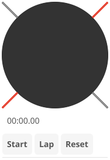

# Stopwatch

Stopwatch app with analog dial display and lap recording.

## Features

- Analog stopwatch dial with sweeping second hand
- Digital time display (minutes:seconds.centiseconds)
- Lap recording with lap times list
- Start/Stop/Reset/Lap controls
- Real-time updates at 60fps for smooth animation

## Controls

| Button | Action |
|--------|--------|
| Start | Begin timing |
| Stop | Pause timing |
| Reset | Clear stopwatch and laps |
| Lap | Record current time as a lap |

## Display

- **Analog dial**: 60-second sweep with tick marks
- **Digital display**: MM:SS.cc format
- **Lap list**: Shows all recorded lap times

## Services

The stopwatch app uses dependency injection for testability:

- `IClockService` - Provides high-resolution time for accurate timing
- `INotificationService` - For future notification features
- `IAppLifecycle` - Manages app close behavior

## Pseudo-Declarative Scorecard

How well does this implementation follow [pseudo-declarative-ui-composition.md](../../docs/pseudo-declarative-ui-composition.md) patterns?

| Category | Pattern | Score | Notes |
|----------|---------|-------|-------|
| **Core declarative** | Nested builder layout | 6/10 | `vbox > hbox(display) + hbox(buttons) + canvasStack(lap ring)` nesting |
| **Core declarative** | Fluent method chaining | 6/10 | `.withId()` on 11 elements: time display, start/stop/lap/reset buttons. No `.when()` or `.bindTo()` |
| **Core declarative** | Programmatic generation | 5/10 | Loop-based lap time list rendering |
| **State architecture** | Observable store | 3/10 | No Observable store. Timer state managed directly |
| **Declarative updates** | `.when()` + `.bindTo()` | 1/10 | No reactive bindings. 4 `setText()` calls for time/lap display |
| **Anti-declarative** | No `removeAll()`/`setContent()` | 0 | No penalty |
| **Testing** | `.withId()` coverage | 6/10 | IDs on all control buttons and display |
| **Design** | Separation of concerns | 6/10 | Service injection (IClockService) provides testability |
| | **Overall** | **4/10** | Clean timer UI with service injection for testability. No reactive bindings — `setText()` drives all updates |
