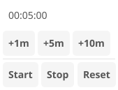

# Timer

Countdown timer app with quick-add buttons and visual feedback.

## Features

- Countdown timer with hours, minutes, seconds display
- Quick-add buttons: +1m, +5m, +10m, +30m, +1h
- Start/Pause/Reset controls
- Notification when timer completes
- Visual countdown display

## Controls

| Button | Action |
|--------|--------|
| +1m, +5m, etc. | Add time to the timer |
| Start | Begin countdown |
| Pause | Pause countdown |
| Reset | Clear timer |

## Services

The timer app uses dependency injection for testability:

- `IClockService` - Provides current time for elapsed calculation
- `INotificationService` - Sends notification when timer completes
- `IAppLifecycle` - Manages app close behavior

## Pseudo-Declarative Scorecard

How well does this implementation follow [pseudo-declarative-ui-composition.md](../../docs/pseudo-declarative-ui-composition.md) patterns?

| Category | Pattern | Score | Notes |
|----------|---------|-------|-------|
| **Core declarative** | Nested builder layout | 6/10 | `vbox > label(display) + hbox(buttons)` nesting. Simple timer layout |
| **Core declarative** | Fluent method chaining | 5/10 | `.withId()` on 8 elements: time display, start/pause/reset buttons. No `.when()` or `.bindTo()` |
| **Core declarative** | Programmatic generation | 2/10 | No loop-based widget generation. Static timer UI |
| **State architecture** | Observable store | 3/10 | No Observable store. Timer state managed directly |
| **Declarative updates** | `.when()` + `.bindTo()` | 1/10 | No reactive bindings. 1 `setText()` call for time display |
| **Anti-declarative** | No `removeAll()`/`setContent()` | 0 | No penalty |
| **Testing** | `.withId()` coverage | 5/10 | IDs on buttons and display |
| **Design** | Separation of concerns | 6/10 | Service injection (IClockService, INotificationService) provides testability |
| | **Overall** | **4/10** | Simple countdown timer with service injection. No reactive bindings |
